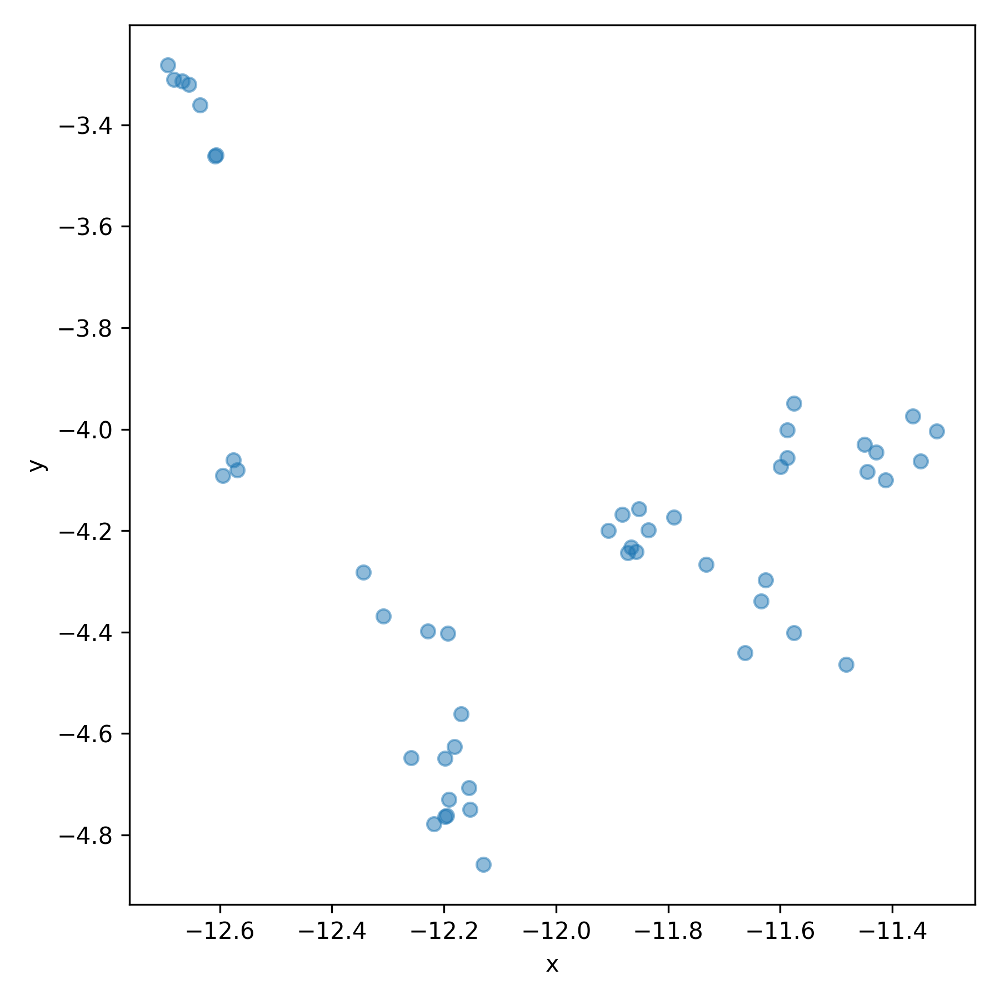
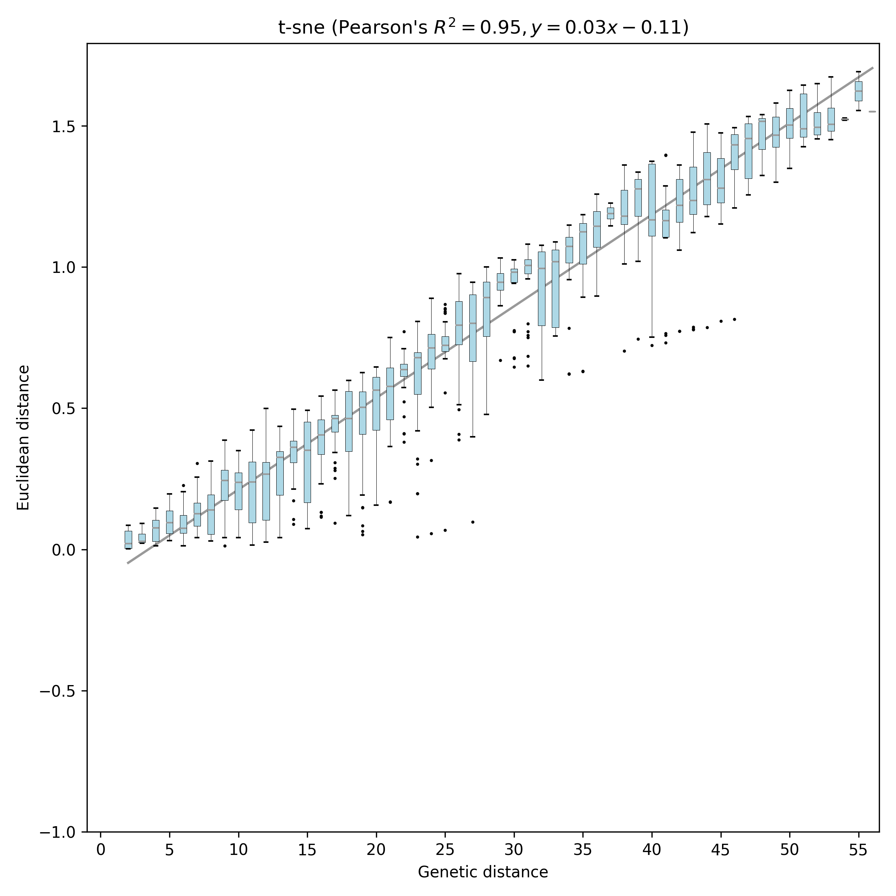
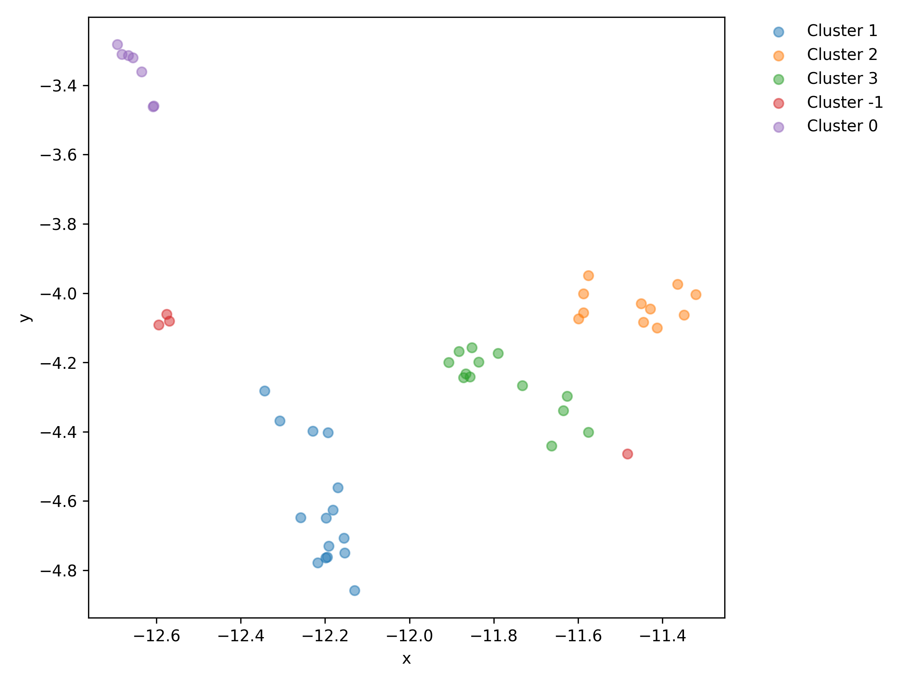

# pathogen-embed

[](https://pypi.org/project/pathogen-embed/)
[](http://bioconda.github.io/recipes/pathogen-embed/README.html)

Create reduced dimension embeddings for pathogen sequences

pathogen-embed is an open-source software to run reduced dimension embeddings (PCA, MDS, t-SNE, and UMAP) on viral populations. For more details, read [Nanduri et al.](https://bedford.io/papers/nanduri-cartography/) and check out [the corresponding GitHub repository](https://github.com/blab/cartography).

 - [Change log](CHANGES.md)
 - [Documentation](https://blab.github.io/pathogen-embed/)
 - [Source Code](https://github.com/blab/pathogen-embed/tree/main)
 - [Bug reports](https://github.com/blab/pathogen-embed/issues)

## Installation

### With pip

```
pip install pathogen-embed
```

### With Conda

```
conda install -c conda-forge -c bioconda pathogen-embed
```

## Quickstart

The following commands show an example of how to apply the pathogen-embed tools to a small set of seasonal influenza A/H3N2 hemagglutinin (HA) sequences.
To start, calculate the distance matrix between each pair of sequences in the dataset.

```bash
pathogen-distance \
  --alignment tests/data/h3n2_ha_alignment.fasta \
  --output distances.csv
```

> (Optional) For faster distance calculations without indel support, use [snp-dists](https://github.com/tseemann/snp-dists).
> This command converts the default tab-delimited output of snp-dists into the comma-delimited format expected by pathogen-embed.
>
> ```bash
> snp-dists -c -b tests/data/h3n2_ha_alignment.fasta > distances.csv
> ```

Create a t-SNE embedding from the distance matrix.
Note that the perplexity is the number of nearest neighbors to consider in the embedding calculations, so this value has to be less than or equal to the total number of samples in the input (N=50, here).

```bash
pathogen-embed \
  --alignment tests/data/h3n2_ha_alignment.fasta \
  --distance-matrix distances.csv \
  --output-dataframe tsne.csv \
  --output-figure tsne.pdf \
  --output-pairwise-distance-figure tsne_pairwise_distances.pdf \
  t-sne \
    --perplexity 45.0
```

The following figure shows the resulting embedding.



The following figure shows the distribution of pairwise Euclidean distances by corresponding pairwise genetic distance.
The equation in the figure title shows how genetic distances (*x* in the equation) scale to Euclidean distances (*y*) in the embedding.



Find clusters in the embedding.

```bash
pathogen-cluster \
  --embedding tsne.csv \
  --label-attribute tsne_label \
  --output-dataframe tsne_with_clusters.csv \
  --output-figure tsne_with_clusters.pdf
```

The following image shows the t-SNE embedding colored by clusters.
Note that the underlying clustering algorithm, [HDBSCAN](https://hdbscan.readthedocs.io/en/latest/), allows samples to not be assigned to any cluster if there isn't a reliable cluster to place them in.
These unassigned samples receive a cluster label of "-1".



If you know the minimum genetic distance you want to require between clusters, you can use the equation from the pairwise distance figure above to determine the corresponding minimum Euclidean distance to pass to `pathogen-cluster`'s `--distance-threshold` argument.

## Example: Identify reassortment groups from multiple gene alignments

To identify potential reassortment groups for viruses with segmented genomes, you can calculate one distance matrix per gene and pass multiple distance matrices to `pathogen-embed`.
Internally, `pathogen-embed` sums the given distances matrices into a single matrix to use for an embedding.
The clusters in the resulting embedding represent genetic diversity in each gene individually and potential reassortment between genes.
The following example shows how to apply this approach to alignments for seasonal influenza A/H3N2 HA and NA.

Calculate a separate distance matrix per gene alignment for HA and NA.

```bash
pathogen-distance \
  --alignment tests/data/h3n2_ha_alignment.fasta \
  --output ha_distances.csv

pathogen-distance \
  --alignment tests/data/h3n2_na_alignment.fasta \
  --output na_distances.csv
```

Create a t-SNE embedding using the HA/NA alignments and distance matrices.
The t-SNE embedding gets initialized by a PCA embedding from the alignments.

```bash
pathogen-embed \
  --alignment tests/data/h3n2_ha_alignment.fasta tests/data/h3n2_na_alignment.fasta \
  --distance-matrix ha_distances.csv na_distances.csv \
  --output-dataframe tsne.csv \
  --output-figure tsne.pdf \
  --output-pairwise-distance-figure tsne_pairwise_distances.pdf \
  t-sne \
    --perplexity 45.0
```

Finally, find clusters in the embedding which represent the within and between diversity of the given HA and NA sequences.

```bash
pathogen-cluster \
  --embedding tsne.csv \
  --label-attribute tsne_label \
  --output-dataframe tsne_with_clusters.csv \
  --output-figure tsne_with_clusters.pdf
```

Compare the resulting embedding and clusters to the embedding above from only HA sequences, to get a sense of how including the NA sequences affects the results.


## Build documentation

Build the [Documentation](https://blab.github.io/pathogen-embed/):

```
make -C /docs html
```

Clean the docs.

```
make -C /docs clean
```

## Releasing a new version

### Information about each file

#### README.md

contains the description of the package pathogen-embed.

#### setup.py

Gives PyPi the instructions about where to find dependent packages, the authors and relevant links, etc. Also gives the entry points for the console script, which tells Pypi to call the main function of __main__.py.

#### __init__.py

Initializes the package, creates the parser to parse the command line arguments and pass them into the embed.py function.

#### __main__.py

Calls the "run" function in __init__.py, which calls embed.py.

#### embed.py

The main code for the package.

### To create new version

Install build dependencies.

``` bash
python3 -m pip install --upgrade build twine
```

Build distribution archives.

```bash
python3 -m build
```

Upload archives to PyPI.

```bash
python3 -m twine upload dist/*
```

Input the username and password, upload new dist files to pypi. Make sure the version of the dist folders does not already exist within pypi.

## Run tests

Run tests with cram.

``` bash
cram tests
```
